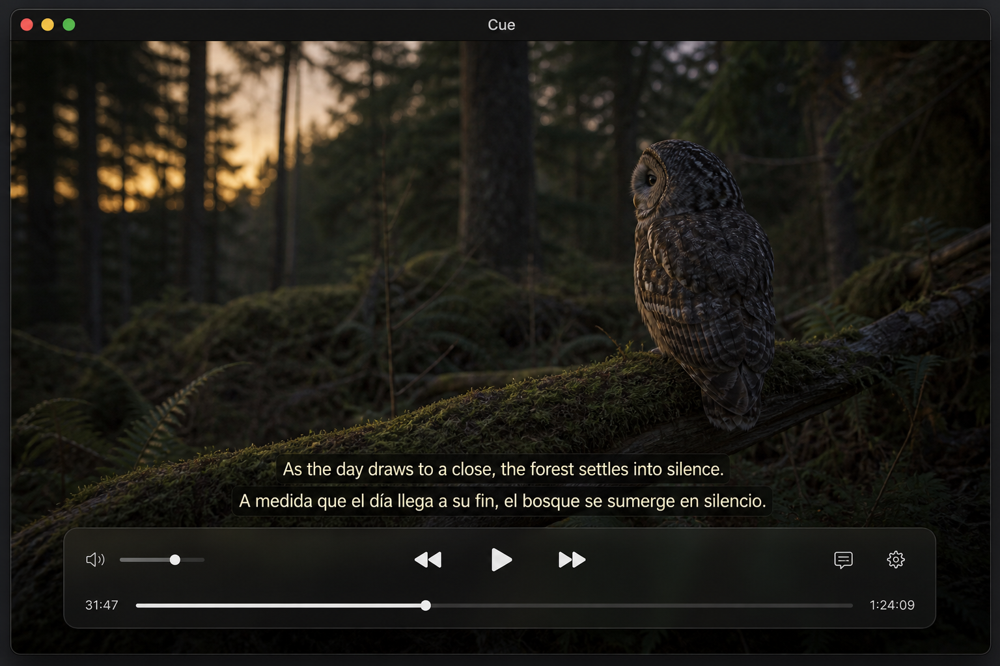
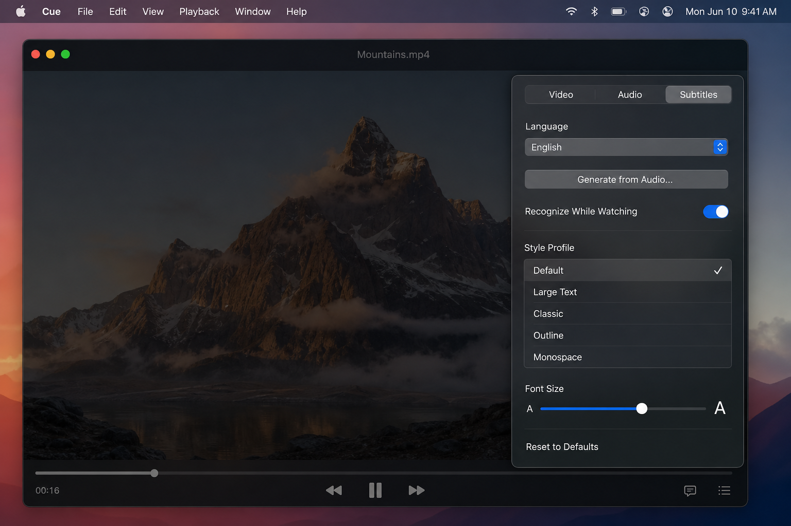

<p align="center">
  
</p>

<h1 align="center">Cue</h1>

<p align="center">
  A native macOS video player with local, on-device subtitles.
</p>

<p align="center">
  <a href="https://github.com/Odweike/cue/releases/latest"></a>
  <a href="LICENSE"></a>
  
</p>

<p align="center">
  <a href="https://github.com/Odweike/cue/releases/latest"><strong>Download Cue.dmg</strong></a>
  ·
  <a href="#install">Install</a>
  ·
  <a href="#features">Features</a>
</p>

Cue plays common local video files (MKV, MP4, MOV, and more) through an embedded LGPL build of libmpv. Subtitles can be imported, styled independently for two tracks, or generated on your Mac with Apple Speech — nothing is sent to a cloud recognizer.

## Screenshots

<p align="center">
  
</p>

<p align="center">
  
</p>

## Install

1. Open the [Releases](https://github.com/Odweike/cue/releases/latest) page.
2. Download **Cue-0.1.0.dmg**.
3. Open the disk image and drag **Cue** into **Applications**.
4. Launch Cue from Applications.

macOS 26 or later is required (Apple’s on-device speech APIs).

If Gatekeeper blocks the first launch, Control-click Cue in Applications and choose **Open**. Cue is currently signed for local distribution, not notarized by Apple.

## Features

- Open a file from the welcome screen, with **⌘O**, or by dropping it on the window
- Draggable, resizable floating control bar that remembers its layout
- Playback for MKV, MP4, MOV, and other formats via libmpv
- Audio track selection and audio/video sync
- Scaling, aspect ratio, crop, rotation, speed, hardware decoding, deinterlace, and color controls
- Import up to two **SRT / VTT / ASS** tracks and render them with a custom overlay
- Independent styles for each visible track, plus named style profiles
- Export any track as **SRT**
- Generate time-coded subtitles locally with Apple Speech, including a while-watching mode
- Bundled open-source notices and LGPL terms in **Help → Open Source Licenses**

## Build from source

```sh
tuist generate
open VideoPlayer.xcworkspace
```

Or from the command line:

```sh
tuist generate
xcodebuild \
  -workspace VideoPlayer.xcworkspace \
  -scheme VideoPlayer \
  -configuration Release \
  -derivedDataPath DerivedData \
  build
```

Package a disk image after a successful Release build:

```sh
./scripts/package-dmg.sh 0.1.0
```

## Architecture

Playback is isolated behind `PlaybackEngine` (libmpv in the shipping app, AVFoundation kept as a fallback). Recognition is isolated behind `TranscriptionEngine`, implemented with `SpeechAnalyzer` / `SpeechTranscriber`. See [SPECIFICATION.md](SPECIFICATION.md) for the original design notes.

## License

Cue is [MIT](LICENSE). It links to an LGPL build of libmpv and related libraries; those terms are included in the app and in `Sources/VideoPlayer/Resources/ThirdPartyLicenses`.
